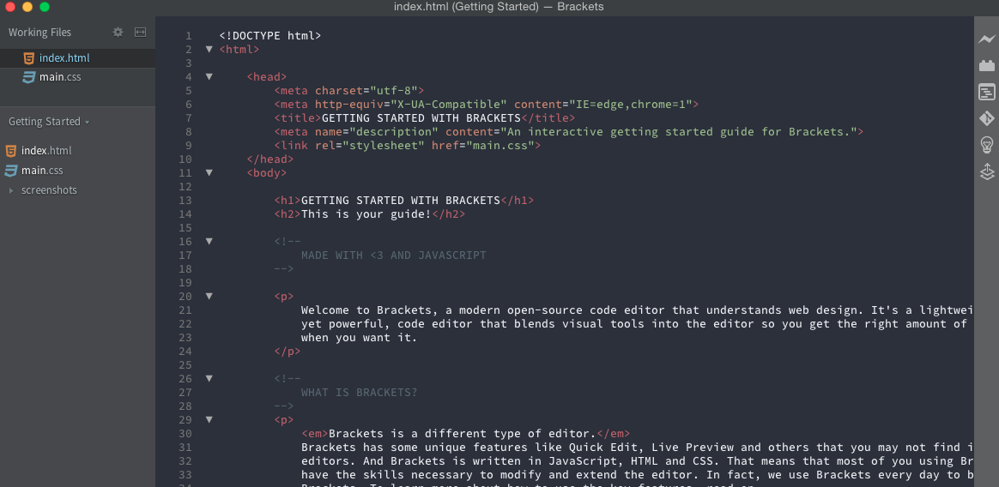
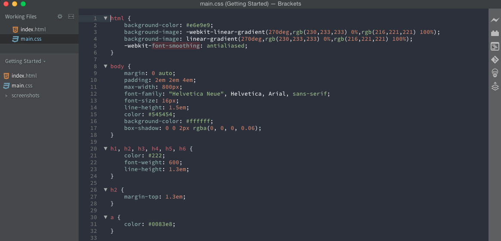
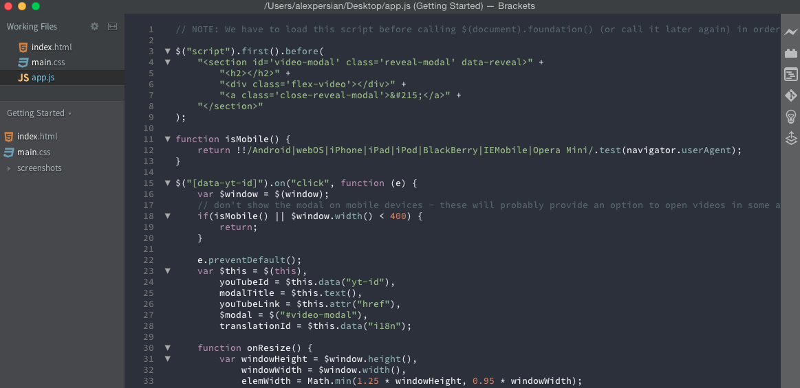

Spacegray-Brackets
===

The popular Spacegray theme from [Sublime Text](http://sublimetext.com/), ported to Brackets.
Original Spacegray theme, [here](https://github.com/kkga/spacegray).
Base 16 color scheme this is based off [here](http://chriskempson.github.io/base16/#ocean).

Screenshots
---

### HTML

### CSS

### JavaScript

Installation
---

This extension requires Brackets Release 1.0 or newer.

1. Open Brackets
2. Open the Extension Manager
3. Switch to "Themes" tab
4. Search for "Spacegray-Brackets"
5. Click "Install"

Known Issues
---
Some syntax highlighting may be off compared to the original Spacegray theme. This is most likely
a result of the way Brackets handles themes.
If you find a mismatch, please feel free to open an issue or pull request. I'll do my best to get
it fixed up quickly.

License
---

The MIT License. Read [LICENSE](LICENSE) for further information.